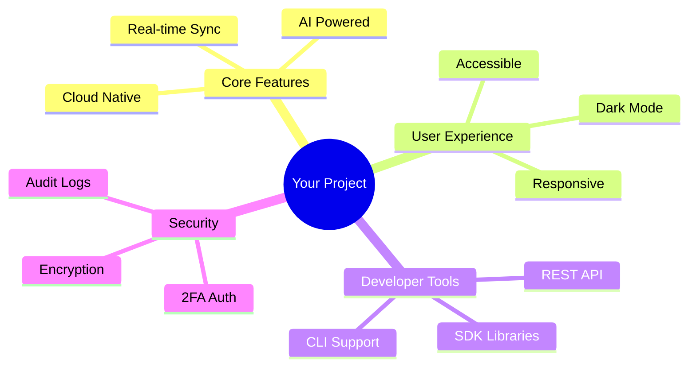
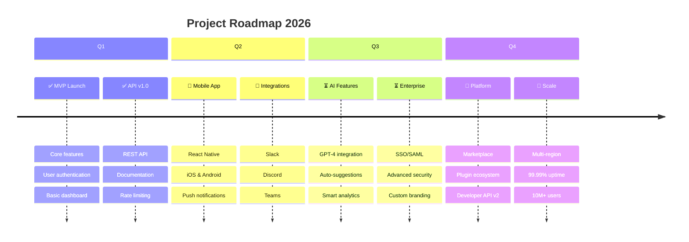

<h1 align="center">
  
</h1>

<p align="center">
  
</p>

<div align="center">

```ascii
╔═══════════════════════════════════════════════════════════════╗
║                                                               ║
║   ██████╗ ██████╗  ██████╗      ██╗███████╗ ██████╗████████╗ ║
║   ██╔══██╗██╔══██╗██╔═══██╗     ██║██╔════╝██╔════╝╚══██╔══╝ ║
║   ██████╔╝██████╔╝██║   ██║     ██║█████╗  ██║        ██║    ║
║   ██╔═══╝ ██╔══██╗██║   ██║██   ██║██╔══╝  ██║        ██║    ║
║   ██║     ██║  ██║╚██████╔╝╚█████╔╝███████╗╚██████╗   ██║    ║
║   ╚═╝     ╚═╝  ╚═╝ ╚═════╝  ╚════╝ ╚══════╝ ╚═════╝   ╚═╝    ║
║                                                               ║
╚═══════════════════════════════════════════════════════════════╝
```

<p>
  <a href="#"></a>
  <a href="#"></a>
  <a href="#"></a>
  <a href="#"></a>
</p>

<p>
  
  
  
  
</p>

**✨ Transform your workflow with intelligent automation ✨**

[🚀 Live Demo](https://demo.link) • [📖 Documentation](https://docs.link) • [💬 Community](https://discord.link) • [🐛 Report Bug](https://github.com/JADAV75/your-repo/issues)

</div>

---


## 📋 Table of Contents

<details open>
<summary><b>Click to expand/collapse</b></summary>

- [🎯 About The Project](#-about-the-project)
- [✨ Key Features](#-key-features)
- [🎨 Screenshots](#-screenshots)
- [🛠️ Built With](#️-built-with)
- [🚀 Getting Started](#-getting-started)
- [💻 Usage Examples](#-usage-examples)
- [🗺️ Roadmap](#️-roadmap)
- [🤝 Contributing](#-contributing)
- [📄 License](#-license)
- [👥 Authors](#-authors)
- [🙏 Acknowledgments](#-acknowledgments)

</details>


## 🎯 About The Project

<div align="center">
  
</div>

<br>

> **"Innovation distinguishes between a leader and a follower."** - Steve Jobs

This project revolutionizes the way we approach **[problem domain]** by providing an intuitive, powerful, and scalable solution that empowers users to **[key benefit]**.

### 🎪 The Problem
Traditional solutions suffer from:
- ⚠️ **Complexity** - Steep learning curves and confusing interfaces
- 🐌 **Performance** - Slow processing and poor optimization
- 💸 **Cost** - Expensive licensing and hidden fees
- 🔒 **Vendor Lock-in** - Proprietary formats and limited integrations

### 💡 Our Solution
We've built a platform that offers:

<table>
<tr>
<td width="25%" align="center">

<h4>Lightning Fast</h4>
<sub>10x faster than alternatives</sub>
</td>
<td width="25%" align="center">

<h4>Easy to Use</h4>
<sub>Intuitive interface, zero learning curve</sub>
</td>
<td width="25%" align="center">

<h4>Cost Effective</h4>
<sub>Free & open-source forever</sub>
</td>
<td width="25%" align="center">

<h4>Modular</h4>
<sub>Plugin architecture, endless possibilities</sub>
</td>
</tr>
</table>


## ✨ Key Features

<div align="center">



</div>

<details open>
<summary><b>🎨 User Interface</b></summary>

- ✅ **Modern Design** - Beautiful, minimalist interface with smooth animations
- ✅ **Dark/Light Mode** - Automatic theme switching based on system preferences
- ✅ **Responsive Layout** - Optimized for mobile, tablet, and desktop
- ✅ **Accessibility** - WCAG 2.1 AAA compliant, keyboard navigation
- ✅ **Customizable** - Themes, layouts, and preferences

</details>

<details>
<summary><b>⚡ Performance</b></summary>

- ✅ **Blazing Fast** - Sub-100ms response times
- ✅ **Optimized** - Code splitting, lazy loading, tree shaking
- ✅ **Cached** - Intelligent caching strategies
- ✅ **CDN Powered** - Global content delivery
- ✅ **Progressive** - Works offline with service workers

</details>

<details>
<summary><b>🤖 AI & Automation</b></summary>

- ✅ **Smart Suggestions** - AI-powered recommendations
- ✅ **Auto-Complete** - Context-aware completions
- ✅ **Natural Language** - Process commands in plain English
- ✅ **Predictive Analytics** - ML-based insights
- ✅ **Automated Workflows** - Set it and forget it

</details>

<details>
<summary><b>🔐 Security & Privacy</b></summary>

- ✅ **End-to-End Encryption** - AES-256 encryption
- ✅ **Zero-Knowledge** - Your data stays yours
- ✅ **Two-Factor Auth** - TOTP, SMS, and biometric
- ✅ **SOC 2 Compliant** - Enterprise-grade security
- ✅ **GDPR Ready** - Privacy by design

</details>

<details>
<summary><b>🔌 Integrations</b></summary>

- ✅ **50+ Integrations** - Connect with your favorite tools
- ✅ **REST API** - Full-featured public API
- ✅ **Webhooks** - Real-time event notifications
- ✅ **OAuth Support** - Secure third-party auth
- ✅ **GraphQL** - Flexible data querying

</details>


## 🎨 Screenshots

<div align="center">

### 🌙 Dark Mode Interface


### ☀️ Light Mode Interface


### 📱 Mobile Responsive

<table>
<tr>
<td width="33%">

</td>
<td width="33%">

</td>
<td width="33%">

</td>
</tr>
</table>

### 🎬 Demo Video

[](https://www.youtube.com/watch?v=dQw4w9WgXcQ)

</div>


## 🛠️ Built With

<div align="center">

### Frontend Arsenal

<p>
  
</p>

### Backend Powerhouse

<p>
  
</p>

### AI & Machine Learning

<p>
  
  
  
</p>

### DevOps & Cloud

<p>
  
</p>

### Testing & Quality

<p>
  
  
</p>

</div>


## 🚀 Getting Started

<div align="center">

### ⚡ Quick Install (Recommended)

```bash
npx create-your-app my-project
```

<sub>Takes less than 2 minutes ⏱️</sub>

</div>

<details>
<summary><b>📦 Manual Installation</b></summary>

<br>

**Prerequisites**

```bash
# Check your versions
node --version  # v18.0.0 or higher
npm --version   # v9.0.0 or higher
git --version   # v2.30.0 or higher
```

**Step 1: Clone & Navigate**

```bash
git clone https://github.com/JADAV75/your-repo.git
cd your-repo
```

**Step 2: Install Dependencies**

```bash
npm install
# or
yarn install
# or
pnpm install
```

**Step 3: Environment Setup**

```bash
# Copy environment template
cp .env.example .env

# Generate secrets
npm run generate:secrets
```

**Step 4: Database Setup**

```bash
# Start database (Docker)
docker-compose up -d db

# Run migrations
npm run db:migrate

# Seed data (optional)
npm run db:seed
```

**Step 5: Launch Application**

```bash
# Development mode
npm run dev

# Production build
npm run build && npm start
```

✅ **Open** [http://localhost:3000](http://localhost:3000)

</details>

<details>
<summary><b>🐳 Docker Setup</b></summary>

<br>

**Using Docker Compose (Easiest)**

```bash
# Clone repository
git clone https://github.com/JADAV75/your-repo.git
cd your-repo

# Start all services
docker-compose up -d

# View logs
docker-compose logs -f

# Stop services
docker-compose down
```

**Manual Docker Build**

```bash
# Build image
docker build -t your-app .

# Run container
docker run -p 3000:3000 \
  --env-file .env \
  --name your-app \
  your-app
```

</details>

<details>
<summary><b>☁️ One-Click Deploy</b></summary>

<br>

<div align="center">

[](https://vercel.com/new/clone?repository-url=https://github.com/JADAV75/your-repo)

[](https://app.netlify.com/start/deploy?repository=https://github.com/JADAV75/your-repo)

[](https://railway.app/template/your-template)

[](https://render.com/deploy?repo=https://github.com/JADAV75/your-repo)

</div>

</details>


## 💻 Usage Examples

### 🎯 Basic Example

```typescript
import { YourApp } from '@your-package/core';

// Initialize the app
const app = new YourApp({
  apiKey: process.env.API_KEY,
  environment: 'production'
});

// Use the features
const result = await app.process({
  input: 'Your data here',
  options: {
    optimize: true,
    cache: true
  }
});

console.log(result);
```

### 🚀 Advanced Usage

```typescript
import { YourApp, Plugins } from '@your-package/core';

// Configure with plugins
const app = new YourApp({
  apiKey: process.env.API_KEY,
  plugins: [
    Plugins.AI({
      model: 'gpt-4',
      temperature: 0.7
    }),
    Plugins.Analytics({
      trackEvents: true
    }),
    Plugins.Cache({
      strategy: 'lru',
      maxSize: 100
    })
  ]
});

// Real-time processing
app.on('data', (data) => {
  console.log('Received:', data);
});

// Error handling
app.on('error', (error) => {
  console.error('Error:', error);
});

// Start processing
await app.start();
```

### 🔌 API Integration

```typescript
// RESTful API
const response = await fetch('https://api.yourapp.com/v1/process', {
  method: 'POST',
  headers: {
    'Authorization': `Bearer ${token}`,
    'Content-Type': 'application/json'
  },
  body: JSON.stringify({
    data: 'your data',
    options: { format: 'json' }
  })
});

const result = await response.json();
```

### 📊 React Component Example

```tsx
import { useYourApp } from '@your-package/react';

function Dashboard() {
  const { data, loading, error, refetch } = useYourApp({
    query: 'dashboard-stats',
    realtime: true
  });

  if (loading) return <Spinner />;
  if (error) return <Error message={error.message} />;

  return (
    <div className="dashboard">
      <Stats data={data} />
      <Charts data={data.charts} />
      <button onClick={refetch}>Refresh</button>
    </div>
  );
}
```

<div align="center">

**📚 [View Full Documentation](https://docs.yourproject.com) | 🎓 [Tutorials](https://docs.yourproject.com/tutorials) | 🔧 [API Reference](https://docs.yourproject.com/api)**

</div>


## 🗺️ Roadmap

<div align="center">



</div>

### 📅 Detailed Timeline

| Quarter | Features | Status |
|---------|----------|--------|
| **Q1 2026** | MVP, API v1, Documentation | ✅ Complete |
| **Q2 2026** | Mobile Apps, Integrations, Analytics | 🔄 In Progress |
| **Q3 2026** | AI/ML Features, Enterprise Plan | ⏳ Planned |
| **Q4 2026** | Marketplace, Global Scale | 💭 Future |

<details>
<summary><b>🎯 View Detailed Milestones</b></summary>

### Version 1.0 - Foundation ✅
- [x] User authentication & authorization
- [x] Core CRUD operations
- [x] Responsive UI/UX
- [x] REST API with documentation
- [x] Database migrations & seeds

### Version 1.5 - Enhancement 🔄
- [x] Real-time updates via WebSocket
- [ ] Advanced search & filtering
- [ ] Export functionality (CSV, PDF)
- [ ] Dark mode support
- [ ] Mobile-responsive improvements

### Version 2.0 - Intelligence ⏳
- [ ] AI-powered recommendations
- [ ] Natural language processing
- [ ] Predictive analytics
- [ ] Advanced automation
- [ ] Machine learning models

### Version 3.0 - Enterprise 💭
- [ ] Multi-tenancy support
- [ ] SSO & SAML integration
- [ ] Advanced role management
- [ ] Audit logging
- [ ] Custom branding

</details>


## 🤝 Contributing

<div align="center">


**We love our contributors! ❤️**

</div>

Contributions are what make the open-source community such an amazing place to learn, inspire, and create. Any contributions you make are **greatly appreciated**!

### 🌟 How to Contribute

1. **Fork** the project
2. **Create** your feature branch
   ```bash
   git checkout -b feature/AmazingFeature
   ```
3. **Commit** your changes
   ```bash
   git commit -m 'feat: Add some AmazingFeature'
   ```
4. **Push** to the branch
   ```bash
   git push origin feature/AmazingFeature
   ```
5. **Open** a Pull Request

### 📝 Contribution Guidelines

<table>
<tr>
<td>

**✅ DO**
- Write clear commit messages
- Follow code style guidelines
- Add tests for new features
- Update documentation
- Keep PRs focused & small
- Be respectful & inclusive

</td>
<td>

**❌ DON'T**
- Submit incomplete work
- Ignore test failures
- Break existing functionality
- Skip code reviews
- Violate code of conduct
- Submit without testing

</td>
</tr>
</table>

### 🏆 Recognition

We recognize all types of contributions:

<div align="center">

| Type | Badge |
|------|-------|
| Code |  |
| Documentation |  |
| Bug Reports |  |
| Ideas |  |

</div>


## 📊 Project Statistics

<div align="center">


</div>


## 📄 License

<div align="center">

Distributed under the **MIT License**. See `LICENSE` for more information.

[](https://opensource.org/licenses/MIT)

</div>


## 👥 Authors

<div align="center">

<a href="https://github.com/JADAV75">
  
  <br/>
  <b>TANVEER JADAV</b>
</a>

<p>

[](https://github.com/JADAV75)
[](https://linkedin.com/in/yourprofile)
[](https://twitter.com/yourhandle)
[](mailto:tanveer.jadav@example.com)

</p>

</div>


## 🙏 Acknowledgments

<div align="center">

Special thanks to these amazing projects and resources:

| Resource | Purpose |
|----------|---------|
| [React](https://react.dev) | UI Framework |
| [Next.js](https://nextjs.org) | React Framework |
| [Vercel](https://vercel.com) | Hosting Platform |
| [Tailwind CSS](https://tailwindcss.com) | CSS Framework |
| [OpenAI](https://openai.com) | AI Integration |
| [Shields.io](https://shields.io) | Awesome Badges |

</div>


## 💬 Community & Support

<div align="center">

### Join Our Community

[](https://discord.gg/yourserver)
[](https://yourslack.slack.com)
[](https://reddit.com/r/yourproject)
[](https://stackoverflow.com/questions/tagged/your-project)

### 📢 Stay Connected

[](https://twitter.com/yourhandle)
[](https://github.com/JADAV75)
[](https://youtube.com/@yourchannel)

</div>


<div align="center">

## ⭐ Star History

[](https://star-history.com/#JADAV75/your-repo&Date)


<p align="center">
  
</p>

### Made with ❤️ by [TANVEER JADAV](https://github.com/JADAV75)

**If this project helped you, please consider giving it a ⭐!**

<sub>Built with 💻 | Powered by ☕ | Inspired by 🌟</sub>

</div>
